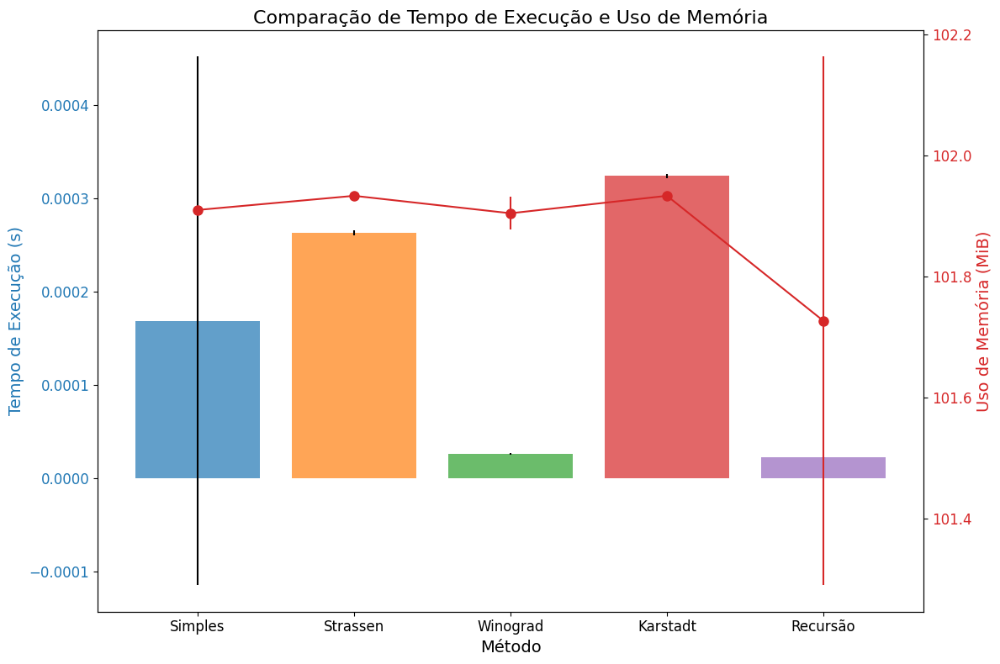

# Victor Aranda RM99667

# Projeto de Multiplicação de Matrizes de 

Este projeto é um Jupyter Notebook projetado para realizar multiplicação de matrizes. Ele permite que os usuários criem e multipliquem matrizes, seja inserindo manualmente as dimensões ou gerando matrizes aleatórias. O notebook utiliza widgets interativos para uma experiência amigável ao usuário.

## Sumário

- [Recursos](#recursos)
- [Primeiros Passos](#primeiros-passos)
  - [Pré-requisitos](#pré-requisitos)
  - [Instalação](#instalação)
- [Uso](#uso)
- [Conclusão](#conclusão)
  - [Matriz A](#matriz-a)
  - [Matriz B](#matriz-b)
  - [Resultado Esperado](#resultado-esperado)
  - [Comparação dos Métodos](#comparação-dos-métodos)
    - [1. Multiplicação Simples](#1-multiplicação-simples)
    - [2. Strassen](#2-strassen)
    - [3. Winograd](#3-winograd)
    - [4. Karstadt](#4-karstadt)
    - [5. Recursão](#5-recursão)
  - [Análise dos Resultados Apresentados](#análise-dos-resultados-apresentados)
  - [Fatores a Considerar na Escolha do Método](#fatores-a-considerar-na-escolha-do-método)
  - [Gráfico de Desempenho](#gráfico-de-desempenho)
  - [Considerações Finais](#considerações-finais)
- [License](#license)


## Recursos

- **Gerar Matrizes**: Os usuários podem especificar o número de linhas e colunas para duas matrizes, que são então criadas com a opção de preencher com valores aleatórios.
- **Multiplicação de Matrizes**: Uma vez que as matrizes são geradas, os usuários podem calcular seu produto com um simples clique de botão.
- **Widgets Interativos**: O notebook usa widgets para entrada, facilitando a interação com as matrizes e a visualização dos resultados.

## Primeiros Passos

### Pré-requisitos

- Python 3.x
- Jupyter Notebook
- Bibliotecas Python necessárias (NumPy, ipywidgets, matplotlib, memory-profiler, tabulate)

### Instalação

1. Instale as bibliotecas necessárias:
   ```bash
   pip install -r requirements.txt
   ```
2. Inicie o Jupyter Notebook:
   ```bash
   jupyter notebook
   ```

### Usage

1. Abra o `Victor Aranda_RM99667.pyinb` notebook.
2. Especifique as dimensões para a Matriz A e a Matriz B.
3. Clique em "Generate Matrices" para criar as matrizes.
4. Opcionalmente, gere matrizes aleatórias clicando em "Generate Random Matrices".
5. Clique em "Calculate" para realizar a multiplicação de matrizes.
6. A matriz resultante será exibida no notebook.

## Conclusão

Neste projeto, implementamos e comparamos diferentes métodos de multiplicação de matrizes utilizando as matrizes A e B. A seguir, discutimos as vantagens e desvantagens de cada método com base nos resultados obtidos, que incluem o tempo de execução e o uso de memória.

### Matriz A

| 49 | 39 |  6 |
|----|----|----|
| 32 |  4 |  5 |


### Matriz B

| 25 | 40 |
|----|----|
| 47 | 12 |
| 46 | 14 |

### Resultado Esperado

| 3334 | 2512 |
|------|------|
| 1218 | 1398 |


## Comparação dos Métodos

### 1. **Multiplicação Simples**:

   - **Vantagens**
    - Algoritmo intuitivo e fácil de implementar.
   - **Desvantagens**
    - Baixa eficiência para matrizes grandes, pois realiza um grande número de multiplicações individuais.

### 2. **Strassen**:
   - **Vantagens**
    - Algoritmo de divisão e conquista que reduz o número de multiplicações em relação ao método simples, especialmente para matrizes grandes.
   - **Desvantagens**
    - Maior complexidade de implementação e pode apresentar sobrecarga para matrizes pequenas devido à divisão recursiva.

### 3. **Winograd**:
   - **Vantagens**
    - Geralmente mais rápido que o método simples e Strassen para matrizes de tamanho específico, reduzindo o número de multiplicações e adições.
   - **Desvantagens**
    - Complexidade de implementação e pode não ser o mais eficiente para todos os tamanhos de matriz.

### 4. **Karstadt**:
   - **Vantagens**
    - Similar ao Strassen, utiliza a divisão e conquista para reduzir o número de multiplicações e em certos casos diminui o numero de interações.
   - **Desvantagens**
    - Complexidade de implementação e pode não ser o mais eficiente para todos os casos.

### 5. **Recursão**:
   - **Vantagens**
    - Pode ser eficiente para determinados tipos de matrizes e estruturas de dados.
   - **Desvantagens**
    - Risco de estouro de pilha para matrizes grandes e pode ser menos eficiente que outros métodos em muitos casos.


## Análise dos Resultados Apresentados

Com base nos dados fornecidos, fizemos as seguintes observações:

- **Tempo de Execução:** O método de Recursão apresentou o melhor desempenho neste caso específico. Contudo, o tempo de execução pode variar com o tamanho das matrizes e as especificações do hardware utilizado.
  
- **Uso de Memória:** Os métodos mostraram um uso de memória semelhante, com pequenas variações entre eles.
  
- **Precisão:** Todos os métodos produziram os mesmos resultados, o que indica que a precisão numérica não foi comprometida.

## Fatores a Considerar na Escolha do Método

Ao escolher o método de multiplicação de matrizes, considere os seguintes fatores:

- **Tamanho das Matrizes:** Para matrizes pequenas, métodos mais simples podem ser adequados. Para matrizes maiores, algoritmos como Strassen, Winograd e Karatsuba podem oferecer melhor eficiência.

- **Hardware:** O desempenho pode ser afetado pela arquitetura do processador, presença de unidades de processamento gráfico (GPUs) e memória disponível.

- **Precisão Numérica:** A precisão dos resultados pode variar entre os métodos, especialmente para matrizes com elementos de ponto flutuante.

- **Complexidade de Implementação:** Algoritmos mais avançados, como Strassen e Winograd, requerem uma implementação mais cuidadosa.

- **Requisitos da Aplicação:** A escolha do método também deve considerar outros fatores, como a necessidade de paralelização, tolerância a erros e tempo disponível para o desenvolvimento.


### Gráfico de Desempenho


### Considerações Finais

O metodo de Karstadt é uma variação do método de Strassen, que utiliza a divisão e conquista para reduzir o número de multiplicações e adições. Em certos casos, o método de Karstadt pode ser mais eficiente que o método de Strassen, especialmente para matrizes de tamanho específico. No entanto, a complexidade de implementação e a eficiência do método podem variar dependendo do tamanho e da estrutura das matrizes.
A utilização desse metodo foi feita com o auxilio de pesquisas tutoriais, inteligencias artificiais e artigos cientificos:

Documentos de referencia [Poster de Karstadt](./ks-poster.pdf). 

Artigo cientifico [Artigo de Karstadt](./SPAA17-MatMul-a-Little-Faster.pdf).

## License

This project is open-source and available under the [MIT License](LICENSE).